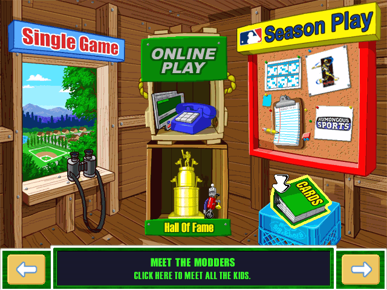

# ⚾ Baller

Modding tools for Backyard Sports, with support for:

- Backyard Baseball 1997/2001
- Backyard Soccer
- Backyard Football
- Backyard Basketball

This project also hosts a [decompilation of Backyard Baseball 2001](https://github.com/whatisaphone/baller/tree/browse).

## Tutorial

<a href="https://www.youtube.com/watch?v=E70mop9JcFw">
    
</a>

Let's extract Backyard Baseball 2001's scripts, modify one of them, and rebuild the game.

Before you start of course, [download the latest release](https://github.com/whatisaphone/baller/releases). Open a terminal and run `baller --help` to make sure it works.

1. Pick some directories to keep your project in. This tutorial uses:

   - `~/bb2001src` as the project directory, for the extracted source files.
   - `~/bb2001game` as the output directory, for the compiled game you can run.

2. Copy your original game files to `~/bb2001game`. Make sure to include all the original data files: `baseball 2001.he0`, `baseball 2001.(a)`, etc.

   Before you start, you could try running the game from this directory with ScummVM to make sure your untouched files are working.

3. Extract the assets to your project directory:

   ```sh
   baller extract ~/bb2001game/baseball\ 2001.he0 ~/bb2001src
   ```

   This will write project.txt, some supporting files, and one directory per room.

4. Modify a script. The file `baseball.scu` contains the hover text for the main lobby in script `lsc2060`. Open it in a text editor and change "Meet the players" to "Meet the modders".

5. Build the assets. This will **overwrite** `baseball 2001.he0` and other files in the output directory.

   ```sh
   baller build ~/bb2001src/project.scu ~/bb2001game/baseball\ 2001.he0
   ```

Now when you run the game, it will use your changed text:



### Talkies

Modifying talkies is similar. Briefly:

```sh
baller talkie extract ~/bb2001game/baseball\ 2001.he2 ~/bb2001talkies
baller talkie build ~/bb2001talkies/talkies.txt ~/bb2001game/baseball\ 2001.he2
```

## Contributing

Install prerequisites:

- Either install [mise], or the version of [Zig] from `mise.toml`

[mise]: https://mise.jdx.dev/
[Zig]: https://ziglang.org/

Run the app:

```sh
zig build run
```

Run the tests:

```sh
zig build test
```

### Running under valgrind

```sh
zig build -Dvalgrind && valgrind --leak-check=full --error-exitcode=1 --exit-on-first-error=yes zig-out/bin/baller <args>
zig build -Dvalgrind test:valgrind
```
