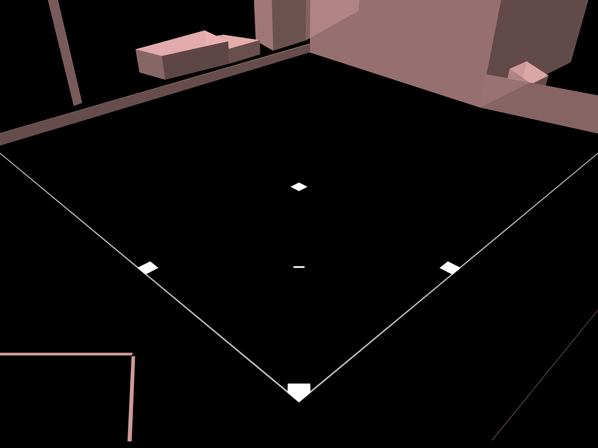
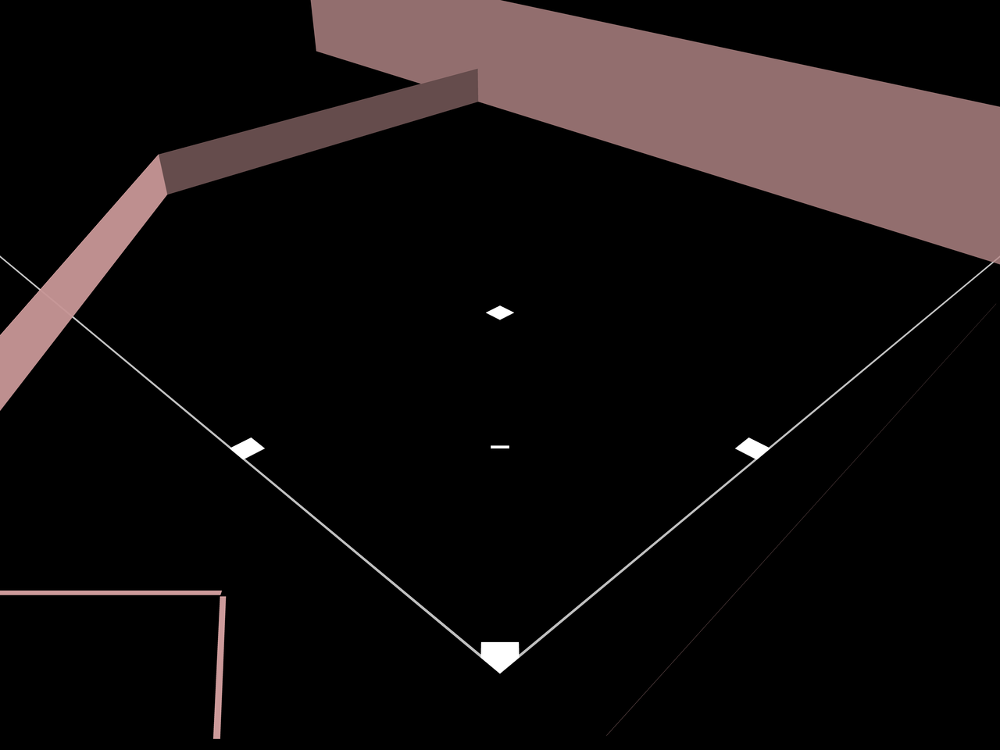
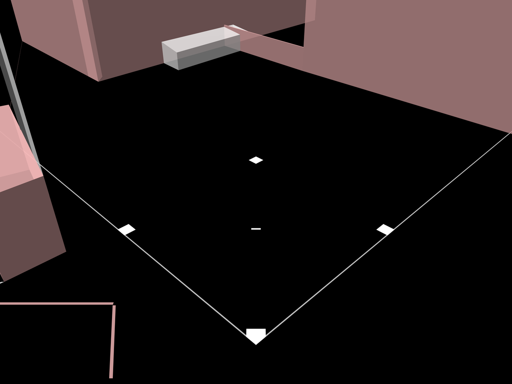
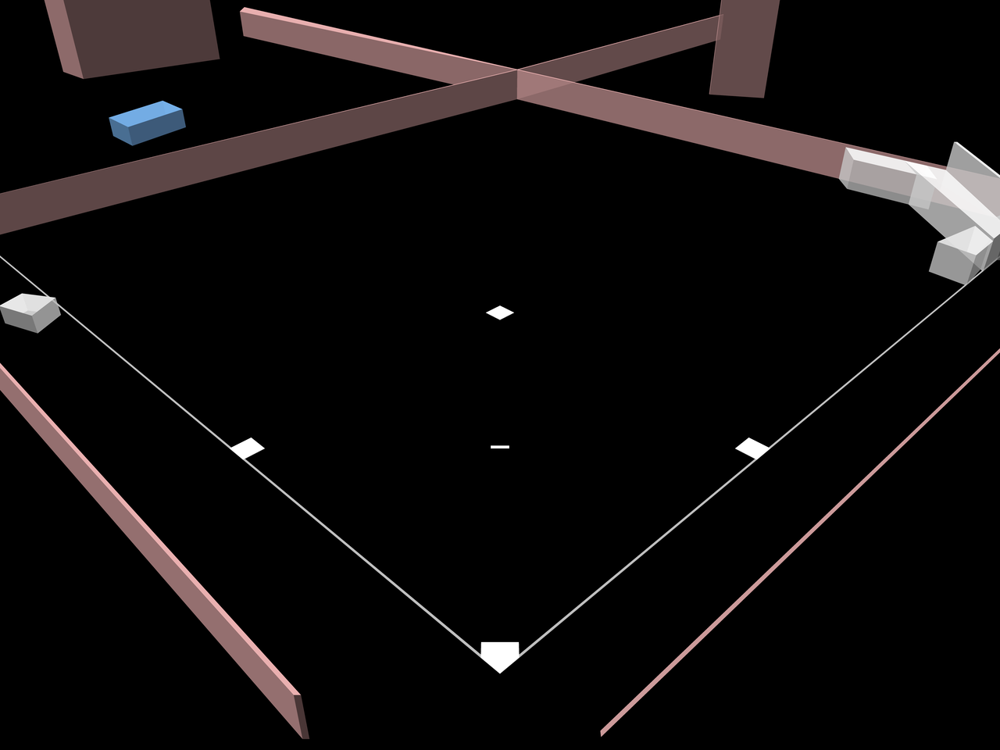
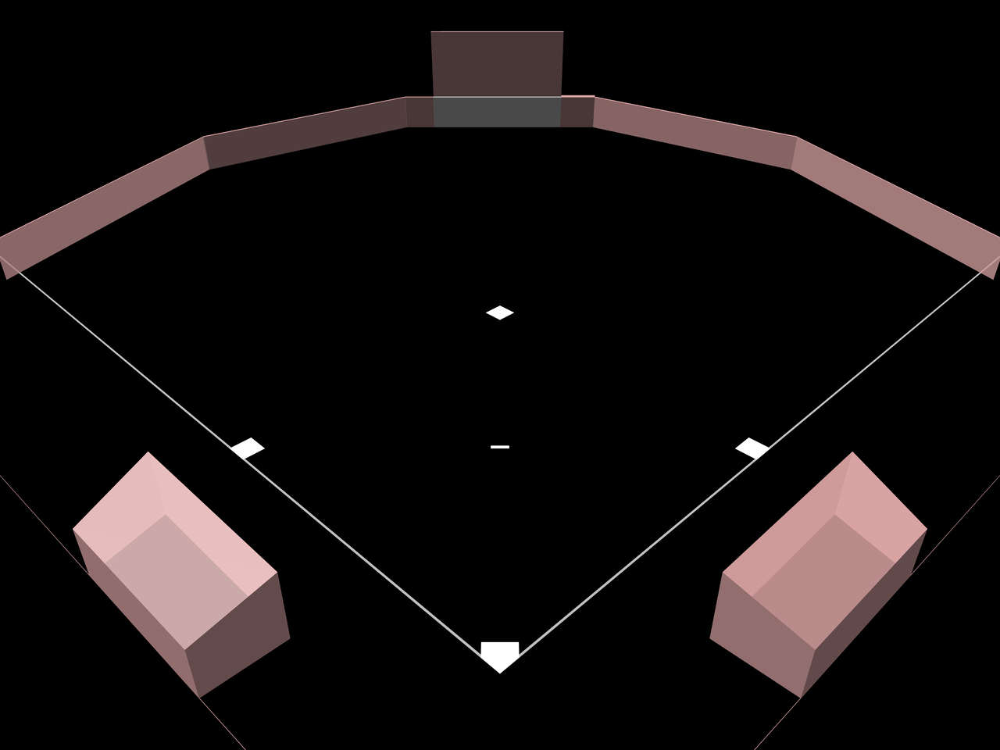
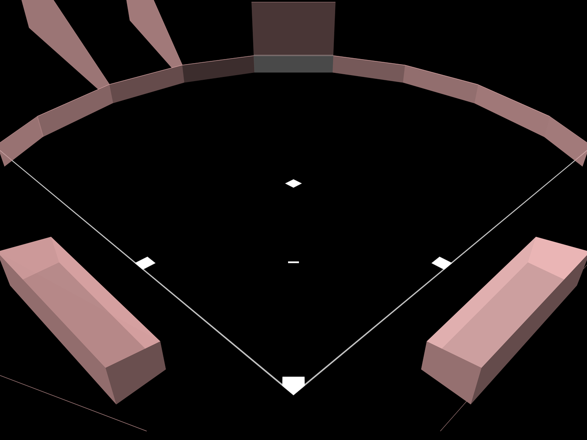
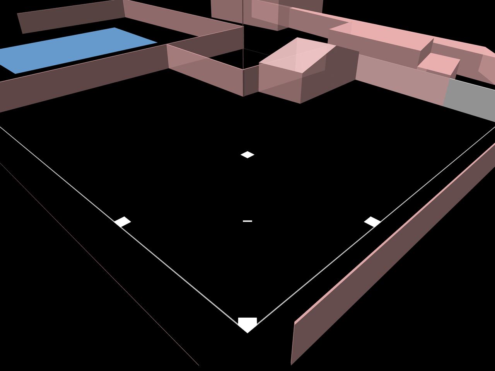
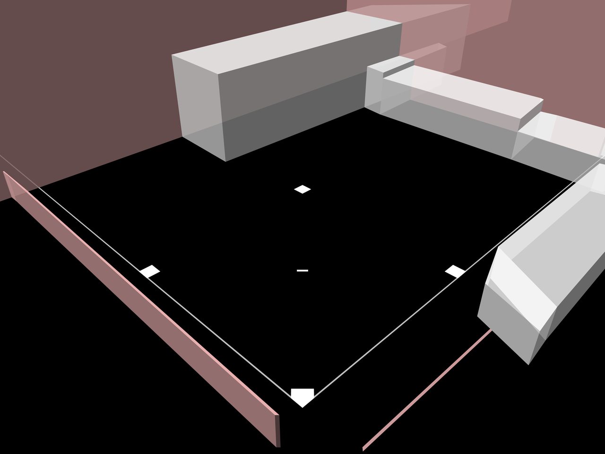
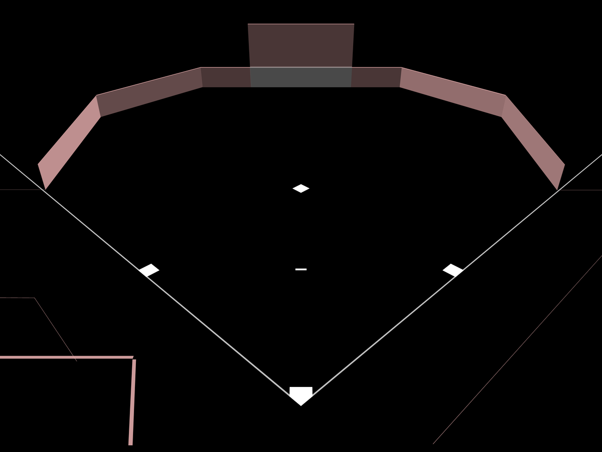
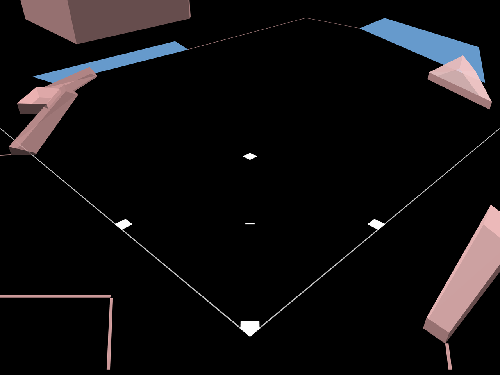

This directory contains the collision meshes for each of the fields, in a few different formats.

## Dirt Yards

## Playground Commons

## Cement Gardens

## Eckman Acres

## Big City Stadium

## Super Colossal Dome

## Steele Stadium

## Tin Can Alley

## Parks Department #2

## Sandy Flats

